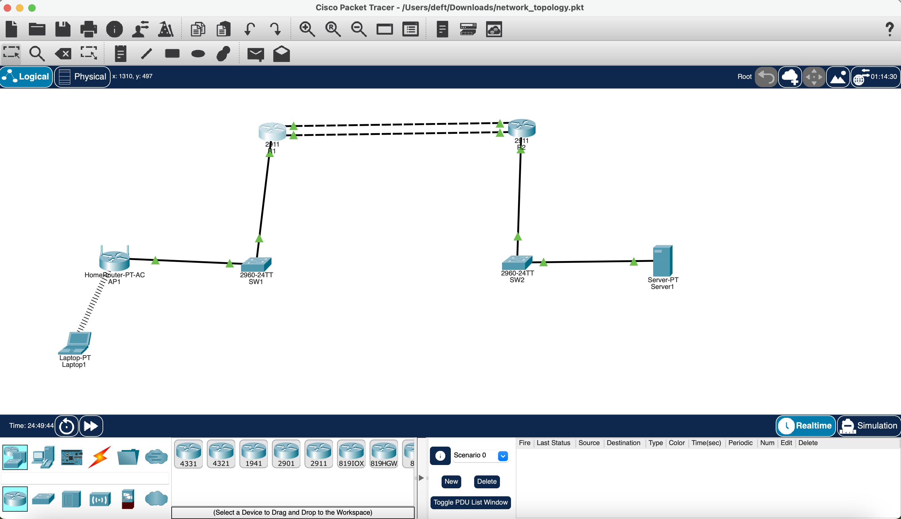
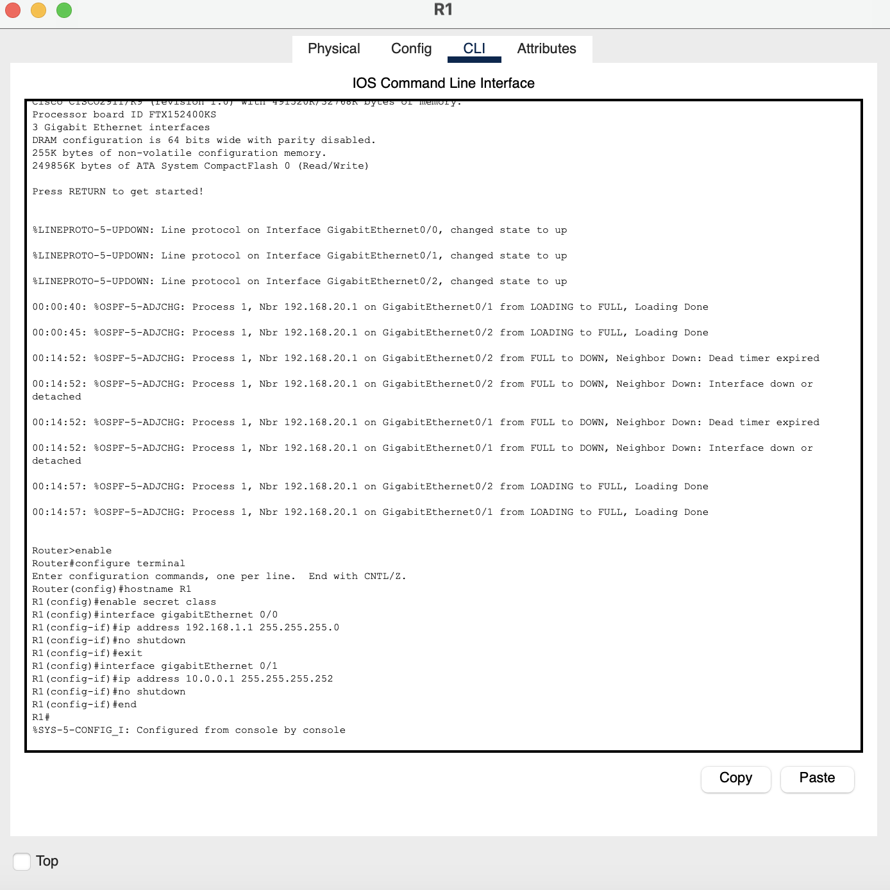
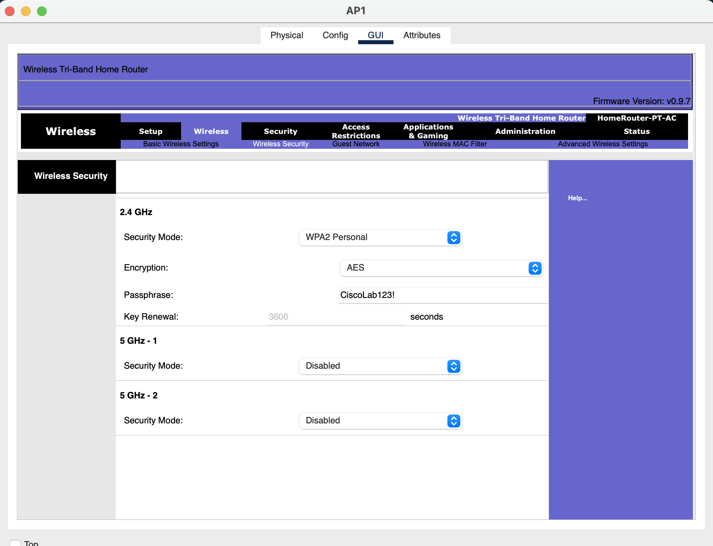
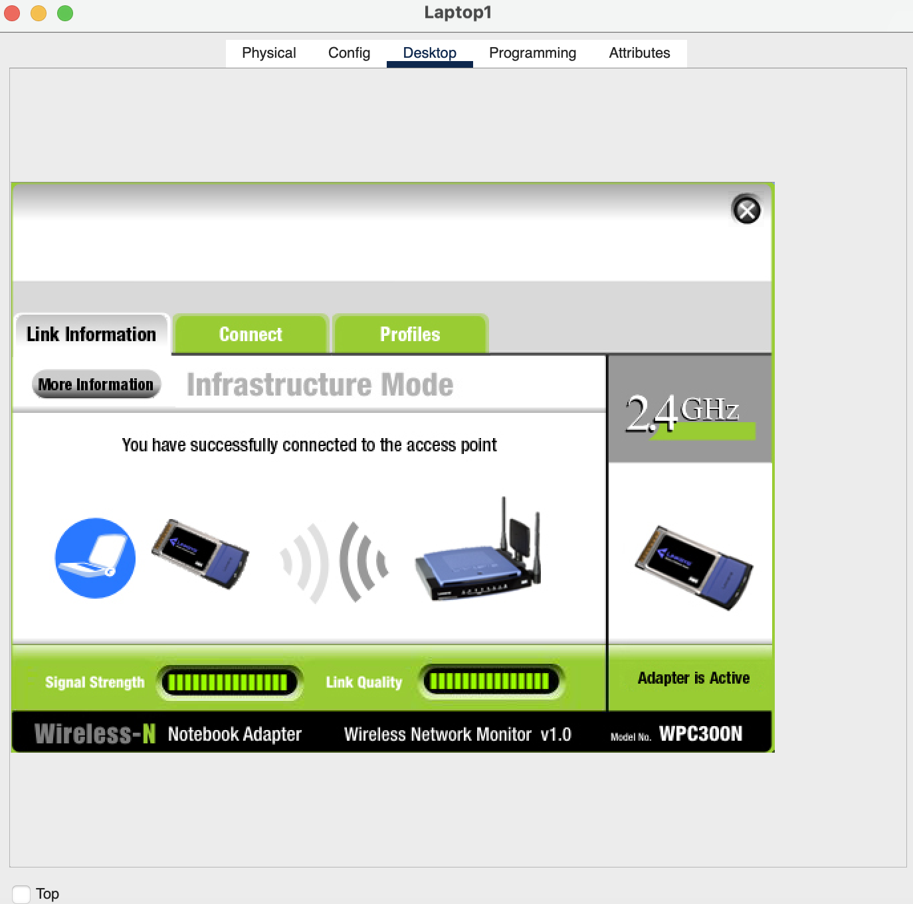
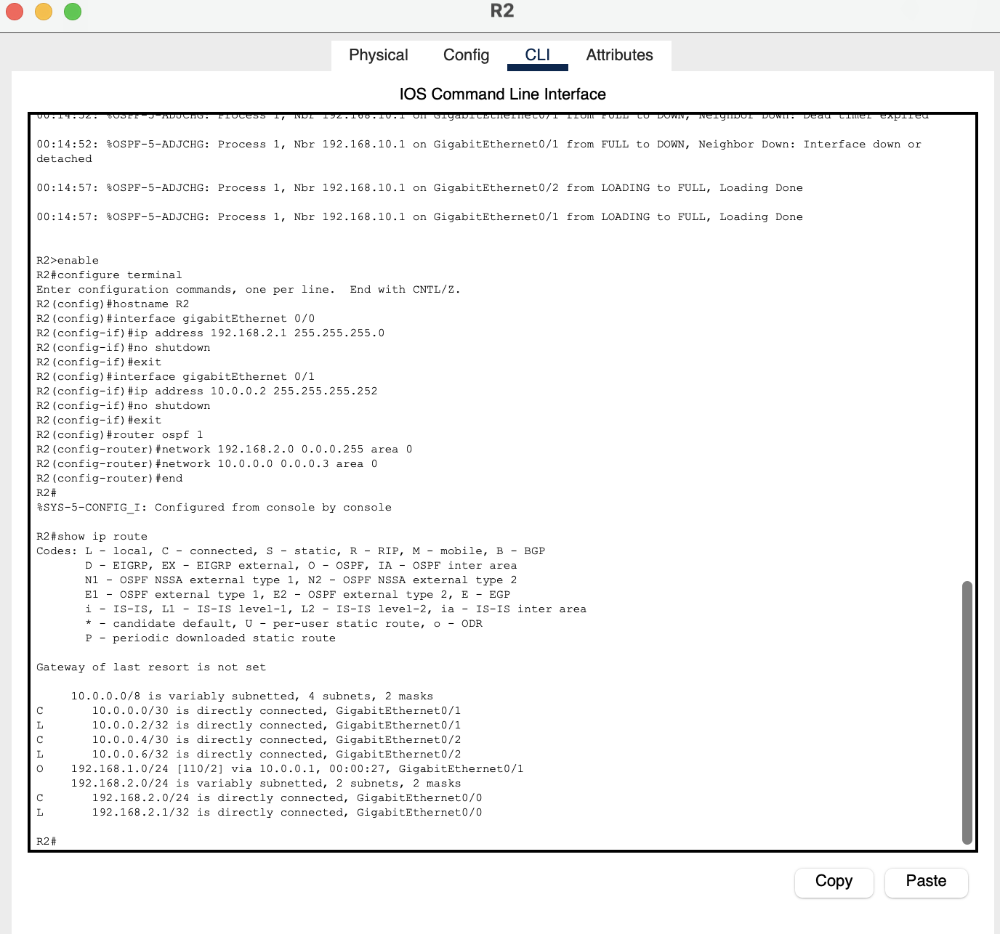
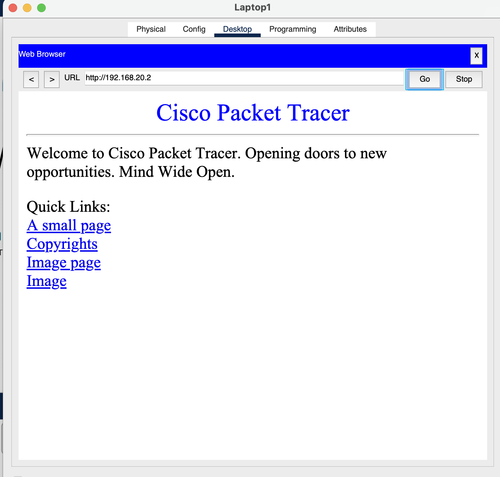
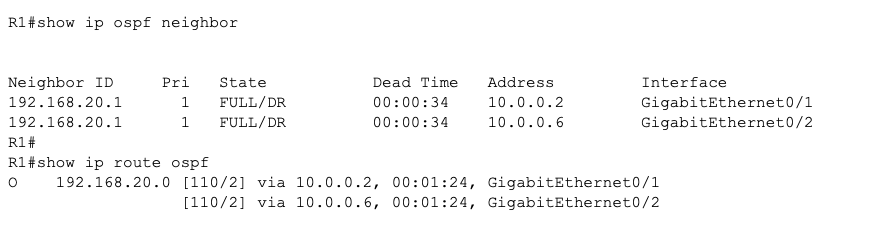
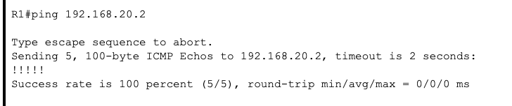
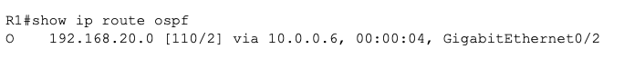
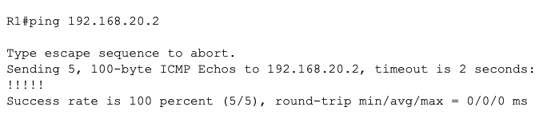

# Smart Server Room Monitoring Infrastructure

## 📝 Project Overview
This project demonstrates the design and configuration of a network infrastructure built to support a Smart Server Room Monitoring system. Designed in Cisco Packet Tracer, the lab establishes end-to-end connectivity across multiple routers and switches, integrating secure wireless access points for remote monitoring laptops and dedicated server nodes for data collection. The core links between routers are built with dual redundant paths, using OSPF to provide automatic failover if one link goes down.

## 🎯 Objectives
* Design and deploy a multi-router network topology with redundant core links.
* Configure basic device security and interface IP addressing on Cisco routers (2911) and switches (2960).
* Implement secure wireless access (WPA2-PSK) for endpoint devices.
* Configure OSPF for dynamic routing and automatic link failover between core routers.
* Apply an extended ACL to restrict ICMP traffic from the client subnet while preserving HTTP access.
* Verify end-to-end connectivity and redundancy under simulated link failure.

## 🛠️ Technologies & Protocols
* **Simulation Tool:** Cisco Packet Tracer
* **Hardware:** Cisco 2911 Routers, Cisco 2960 Switches, Generic Access Points
* **Protocols:** IPv4, WPA2-PSK, ICMP, OSPF, Extended ACL

---

## 🗺️ Network Topology



The network consists of two main sites connected via **dual redundant links** between R1 and R2:
1. **Remote Access Site:** Laptop connected wirelessly to an Access Point, which connects to SW1 and R1.
2. **Data Center Site:** Main Server connected to SW2 and R2.

R1 and R2 are connected by two separate GigabitEthernet links, with OSPF running across both so traffic can automatically reroute if either link fails.

---

## 🚀 Implementation Steps

### Step 1: Base Device Configuration
Configured hostnames, enable secret passwords, and IP addressing on the GigabitEthernet interfaces of R1 and R2.



### Step 2: Wireless Network Setup
Configured AP1 with WPA2-Personal security to allow monitoring devices to securely join the network.



Laptop1 successfully authenticated to the wireless network:



### Step 3: OSPF Routing Configuration
Configured OSPF area 0 on both R1 and R2, advertising all connected networks including both core links between the routers, so traffic automatically reroutes if one link fails instead of relying on a single static path.

### Step 4: Server Configuration
Configured Server1 with a static IP and enabled the HTTP service to support the monitoring application.



### Step 5: Access Control
Applied an extended ACL on R2 to deny ICMP traffic from the client subnet (192.168.10.0/24) to the server, while still permitting HTTP access — demonstrating selective filtering rather than blocking the remote site entirely.

---

## ✅ Verification and Testing
Since the ACL blocks ICMP from the client subnet, HTTP access was used from Laptop1 to confirm end-to-end connectivity across the routing boundary:



The successful page load confirms that routing, wireless authentication, ACL filtering, and physical layer connections are all correctly established.

---

## 🔄 Redundancy & Failover Testing

To validate that the dual-link design provides real fault tolerance, one of the two core links was intentionally shut down while traffic was in flight.

**Baseline: both links active**



OSPF forms a FULL neighbor adjacency over both links, and the routing table shows two equal-cost paths (ECMP) to the server subnet.

**Baseline ping (before failure)**



**Simulated failure:** GigabitEthernet0/1 on R1 was administratively shut down.

**Routing table after failure**



OSPF removed the failed path, leaving only GigabitEthernet0/2 as the active route.

**Ping after failure**



Connectivity to the server was maintained with 0% packet loss, confirming that OSPF successfully rerouted traffic over the surviving link without manual intervention.

## 📁 Repository Structure

```text
├── images/
│   ├── pic1.png
│   ├── pic2.png
│   ├── pic3.png
│   ├── pic4.png
│   ├── pic5.png
│   ├── pic7.png
│   ├── pic8.png
│   ├── pic9.png
│   ├── pic10.png
│   └── pic11.png
├── network_topology.pkt
└── README.md
```

## 🧾 Conclusion
This lab demonstrates a resilient network design combining dynamic routing, secure wireless access, and traffic filtering. By implementing OSPF across dual redundant links, the network automatically maintains connectivity to the central monitoring server even when a core link fails, ensuring the smart server room monitoring system remains operational under partial infrastructure failure.
